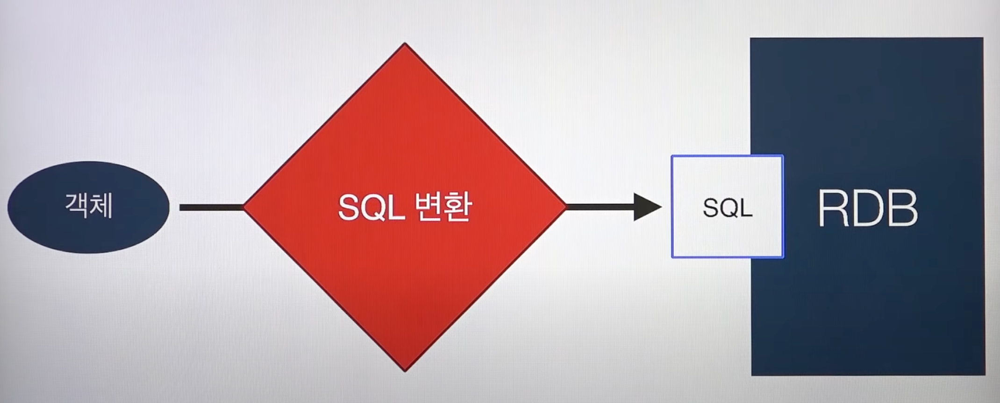
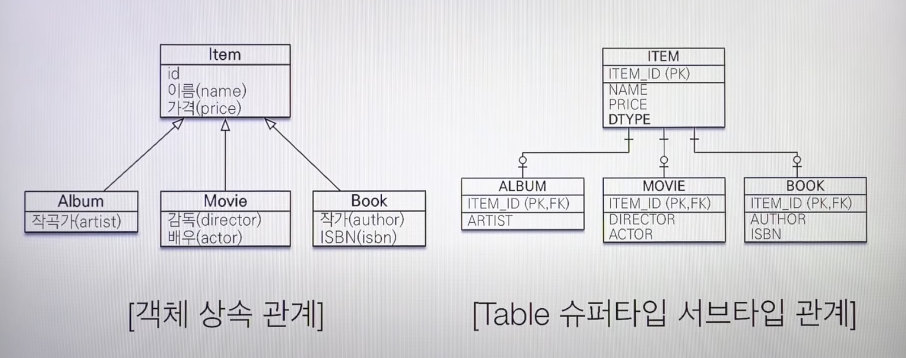
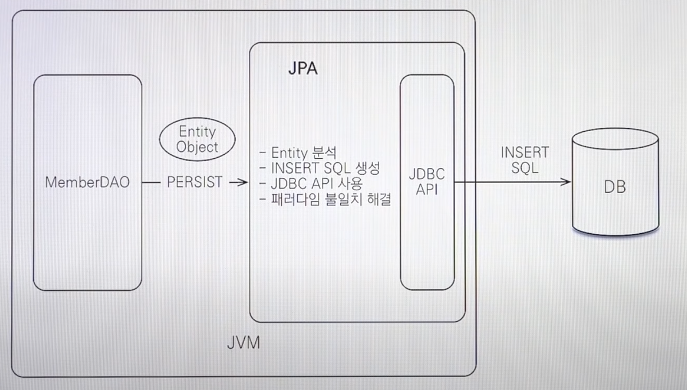
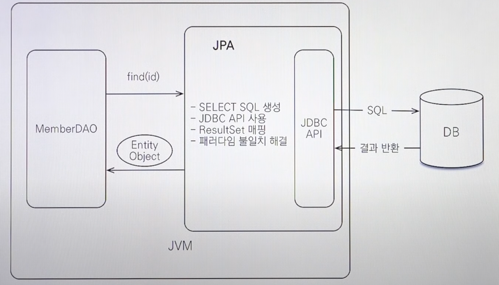

# Spring JPA

> 김영한 저자의 '자바 ORM 표준 JPA 프로그래밍' 및 강의를 바탕으로 
> Spring JPA를 공부한다.
>
>  

### Server Spectiication
- IntelliJ (Mac OS X)
- Java 11
- H2 Database
- JPA


### JPA (Java Persistence API)

##### 왜 JPA를 사용할까?

> Database는 아직까지 관계형 DB - [Orable, MySQL, MariaDB] 등을 사용한다.
>
> * 지금 시대는 **객체를 관계형 DB에** 관리한다.
>
> 
>
> 관계형 DB는 SQL을 계속해서 작성해야한다.


1. SQL 중심적인 개발의 문제점

- CRUD의 무한 반복

  > 무한반복하며 지루한 코드의 연속

  ```java
  public class Member {
    private String memberId;
    private String name;
  
    ...
      
  }
  ```
  
  ```sql
  INSERT INTO Member (Member_ID, NAME) VALUES
  SELECT MEMBER_ID, NAME FROM MEMBER M
  UPDATE MEMBER SET ...
  ```

* 여기서 만약 Member의 '연락처'가 추가된다면? - [필드 추가]
  * 연락처 tel 변수가 추가되며 **모든 쿼리를 수정해주어야한다**.
  * 쿼리수정시 실수가 발생하면 정상작동하지 않는다.

* 엔티티 신뢰 문제

  ```java
  class MemberService {
  	  ...
      
      private void process(String id) {
        Member member = memberDAO.find(id);
        member.getTeam(); // ??
        member.getOrder().getDelivery(); // ???
      }
  }
  ```

  객체지향적인 코드에서 Member가 어떤 Team에 속한다면,

  MemberDAO에서 find해서 member 변수를 받아오고, 그 멤버 객체에서 .getTeam()으로 팀을 가져온다.

  1. Member가 소속된 팀 객체를 가져오는것
  2. Member가 주문된 정보, 주문의 배송지 정보를 가져오는 것

  이것이 불가능하다.

  Member DAO에서 Member 객체를 가져오는데, Team과 Order, Delivery의 연관에 대한 모든것을 가져와야한다.

  즉, MemberDAO에서 query가 Team, Order, Delivery를 다 가져와야한다. 

  보장이 되지 않는다면 이러한 코드 작성이 불가능하다.

> 계층형 아키텍처 - [Controller, Service, Repository, DAO ... ]
>
> 진정한 의미의 **계층 분할이** 어렵다.


* 패러다임의 불일치 - 객체 vs. 관계형 데이터베이스

> 객체지향과 관계형 데이터베이스는 사상이 다르다.
>
> 관계형 데이터베이스는 철저하게 데이터를 잘 저장할지에 Focus 되어있다.
>
> 이 두 가지를 억지로 Mapping해서 작업을 해야한다는 번거로움이 있다.
>
> '객체 지향 프로그래밍은 추상화, 캡슐화, 정보은닉, 상속, 다향성 등 시스템의 복잡성을 제어할 수 있는 다양한 장치들을 제공한다'


객체를 영구 보관하는 다양한 저장소 - [Object] 

- RDB
- NoSQL
- File
- OODB

> 현실적으로 RDB, NoSQL을 사용하기에 현실적으로는 관계형 DB를 사용한다.

 

- 객체를 SQL로 **우리가** 바꾸고, 저장을 해야한다.
- 즉, 개발자 == SQL 매퍼 역할이었다.


##### 그렇다면 근본적으로 객체와 관계형 데이터베이스는 무슨 차이가 있을까?

1. 상속

    

   - 관계형 데이터베이스에는 상속 관계가 있을까?
     - 있는 데이터베이스도 있지만, 당연히 없다.
     - 객체는 있는데 이거를 어떻게 풀어낼까?
   - Album을 저장한다 해보자.
     - 객체 분해
     - INSERT INTO ITEM ...
     - INSERT INTO ALBUM ... 
     - 최소 두 개의 Query 작성을 해야한다. 
   - 조회는 어떻게 할것인가?
     - Item과 Album을 JOIN해서 가져온다. Select ~ Item Join Album
     - **문제는** Movie, Book은??? 
       - **그때마다 새로운 join 쿼리를 작성한다**
     - 그래서 DB는 상속관계 없이, Super ITEM DTO를 만들어서 다 들어있는걸 사용한다...


2. 연관관계

   - 객체는 **참조** 를 사용한다: member.getTeam()

   - 테이블을 **외래 키** 를 사용한다: JOIN ON M.TEAM_ID = T.TEAM_ID

   - 이 둘은 매우 다르다

     - 객체
       - Member.getTeam()으로 Team으로 갈 수 있음
       - Team만 조회했을때 member로 갈수있나? **없다**
     - 테이블
       - Member를 조회, Team Join해서 갈 수 있음
       - Team을 조회 Member로 갈 수 있음 join 하면된다.
     - 객체 Reference를 통한 연관관계는 **방향성이 있음**
     - DB에서 Foreign Key는 **방향성이 없음**. 하나만 있으면 반대로 왔다갔다 가능
     - 양방향 연관관계 Mapping이 매우 중요하지만 어려움 (JPA의 포인터 같은 놈)

     

   - **객체를 테이블에 맞추어 모델링**

     * ```java
       class Member {
         private String id;	// MEMBER_ID 컬럼 사용
         private Long teamId; // TEAM_ID FK 컬럼 사용
         private String username; // USERNAME 컬럼 사용
       }
       ```

     * ```java
       class Team {
         private Long id; // TEAM_ID PK 사용
         private String name; // NAME 컬럼 사용
       }
       ```

     * Member Class에 teamId라는 외래키 값을 그대로 넣는다.즉 외래키 자체를 그대로 Mapping 한다.

       * 객체지향적으로는 Member에 Team 객체가 있는게 더 객체지향적 (Id 값만 있는게 아닌)

     * 근데 이러한 설계를 객체지향적이지 않다는 딴지를 걸며 객체다운 모델링으로 바꾸면??
       * ```java
         class Member {
           private String id;	// MEMBER_ID 컬럼 사용
         	private Team team; // 참조로 연관관례를 맺는다.
           private String username; // USERNAME 컬럼 사용
           
           Team getTeam() {
             return team;
           }
         }
         ```

       * ```java
         class Team {
         	private Long id;
           private String name;
         }
         ```

         Member 객체가 Team 객체를 갖고있음 

         TEAM_ID는 member.getTeam().getId(); 로 넣는다 !?

         INSERT INTO MEMBER (MEMBER_ID, TEAM_ID, USERNAME) VALUES ...

       * 이럴경우 조회하려면 ... HELL 시작

         ```sql
         SELECT M.*, T.*
         FROM MEMBER M
         JOIN TEAM T ON M.TEAM_ID = T.TEAM_ID
         ```

         ...

         ```java
         public Member find(String memberId) {
           // SQL 실행 ...
           
           Member member = new Member();
           
           // 데이터베이스에서 조회한 회원 관련 정보를 모두 입력...
           
           Team team = new Team();
           
           // 데이터베이스에서 조회한 팀 관련 정보를 모두 입력...
           
           member.setTeam(team); // **
           return member;
         }
         ```

         많이 길다... 코드가 너무 길어도 너무 길다 ...

       * 이렇게 반환하면..? 뭔가 이상하다... 기존에 한방 쿼리로.. Member_Team 이란 DTO를 갖고있었는데... 이렇게 객체지향적으로 하니까 너무 길다... 복잡하다...

3. 데이터 타입

4. 데이터 식별 방법

 

**객체 지향적으로 모델링 할수록 매핑 작업만 늘어난다**

**객체를 자바 컬렉션에 저장하듯이 DB에 저장할 수 없을까 ?**

##### JPA - Java Persistence API

- Java 진영의 **ORM **기술 표준

##### ORM ?

- Object-Relational Mapping (객체 관계 매핑)
- 객체는 객체대로 설계
- 관계형 데이터베이스는 관계형 데이터베이스대로 설계
- ORM 프레임워크가 중간에서 Mapping
- 대중적인 언어에는 대부분 ORM 기술이 존재한다.


##### JPA 동작 - 저장

 

* MemberDAO에 회원 객체를 넘기면 JPA **Persist** 라는 명령어가 Entity를 분석해서 Insert Query를 만들어준다.
* 객체를 DB로 바꿀 뿐 아니라 **패러다임 불일치를 해결한다**
  * JPA가 알아서 Insert 쿼리를 두 번 만들어서 넣는다. 즉 Member Class, Album Class에 다 넣는다.
  * JPA를 통해 Album 객체를 조회하면, **JPA가 알아서 Album 객체와 Join을 해서 Album 객체를 가져온다.**

##### 

##### JPA 동작 - 조회

 

* JPA가 find(식별자)를 하면, 패러다임 불일치를 해결한 적절한 SQL을 생성한다.


##### JPA 소개

- EJB - 엔티티 빈 (자바 표준)
- 하이버네이트 (Hibernate, 오픈소스) 
- JPA (자바 표준) - **JPA는 인터페이스, 실질적인 구현체는 Hibernate 를 사용한다.**


