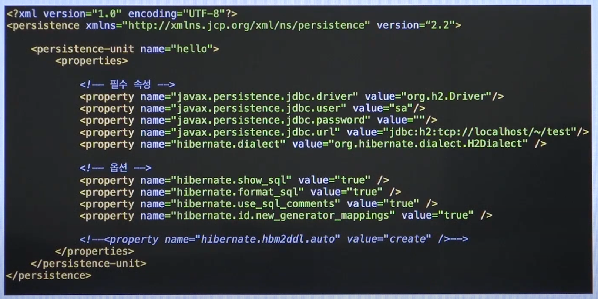
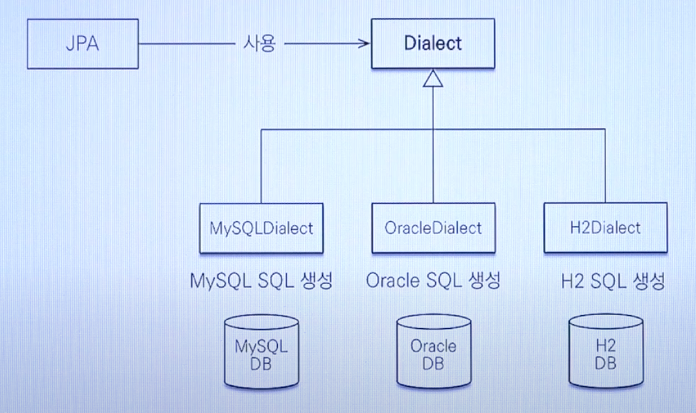
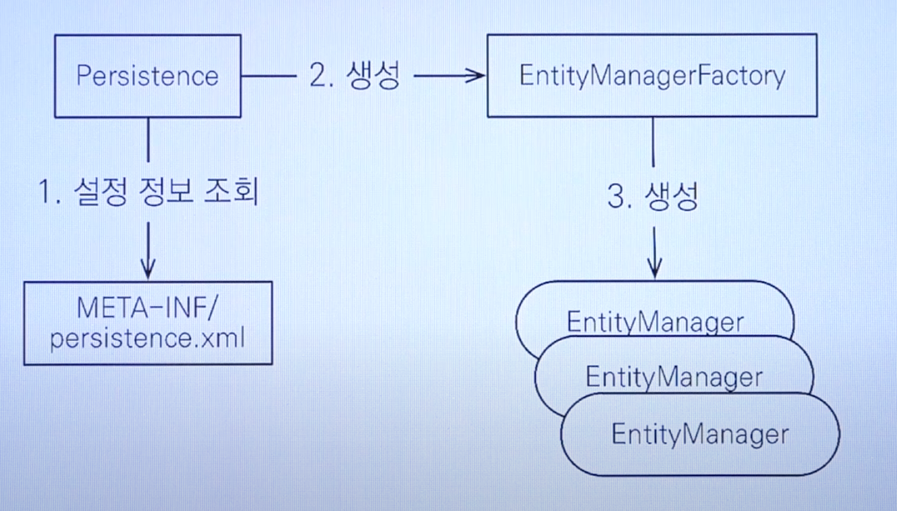

### 객체 매핑하기

* @Entity: JPA가 관리할 객체
  * 엔티티라고 한다
* @Id: DB PK와 매핑 할 필드

```java
@Entity
public class Member {
  @Id
  private Long id;
  private String name;
  ...
}
```

```sql
create table Member (
	id BIGINT not null,
	name varchar(255),
	primary key (id)
)
```

> @Entity를 넣어놔야 JPA가 DB와 mapping 해준다.
>
> DB의 Member Table에 id가 실제 객체 Member의 id가 되는데, 원한다면 Annotation을 이용하여 DB 테이블에
>
> username을 객체의 필드 name과 매핑 시킬수 있다.


### Persistence.xml

- JPA 설정 파일
- /META-INF/persistence.xml에 위치
  -  
  - XML 문서에 persistence unit 등이 있는데, database 접속 정보 등의 옵션을 설정할 수 있음.
  - Option:
    - jdbc driver
    - **hibernate.dialect**: javax.persistence로 시작하는건 jpa로 표준, hibernate로 시작하는건 hibernate로만 사용할때 가능
    - dialect - [**<u>데이터베이스 방언</u>**]
      - JPA는 특정 데이터베이스에 종속적이지 않은 기술
      - 각각의 데이터베이스가 제공하는 SQL 문법, 함수가 조금씩 다르다
        - 가변문자: MySQL은 VARCHAR, Oracle은 VARCHAR2
        - 문자열을 자르는 함수: SQL 표준은 SUBSTRING(), Oracle은 SUBSTR()
        - **페이징: MySQL은 Limit, Oracle은 ROWNUM**
      - 방언: SQL 표준을 지키지 않거나 특정 데이터베이스만의 고유한 기능
    -  
    - 즉 dialect 설정으로 알맞는 database에 맞는 SQL query문을 JPA에서 작성해준다.

- javax.persistence로 시작: JPA 표준 속성
- hibernate로 시작: 하이버네이트 전용 속성


### 애플리케이션 개발

- 엔티티 매니저 팩토리 (Entity Manager Factory) 설정
  -  
  - EntityManagerFactory는 Entity Manager를 만든다.
  - 트랜잭션 단위로 처리할 때마다 Entity Manager를 생성한다
  - Entity Manager Factory는 **<u>하나만</u>** 생성해서 애플리케이션 전체에서 공유해야한다.
  - Entity Manager는 Thread간에 공유하면 안된다, 즉 사용하고 버린다.
    - 사용자의 1회 비즈니스 로직에 한 번 Entity Manager를 사용하고 해당 Entity Manager는 버린다.
  - JPA의 모든 데이터 변경은 트랜잭션 안에서 실행한다.
- 엔티티 매니저 설정
- 트랜잭션
- 비즈니스 로직 (CRUD) 


### 여러가지 문제들

1. Test 코드에서 작성했을때 Member -> (OneToMany) Team 의 연관관계의 테이블에서, team과 Member를 각 인서트 하였다. 그 후 Member 객체를 테이블에서 조회한 다음 로그를 찍었는데, 이 때 select 문이 team에 대한 내용 없이 member만을 찾아보았다 왜그럴까?
   - Transaction의 범위를 생각해보아야한다. Annotation으로 달아놓은 @DataJpaTest는 @Test annotation 아래의 하나의 메소드 전체가 트랜잭션 범위에 포함된다. 즉 @Transactional 을 달아놓은것과 같은 효과이다. 
   - 이럴경우, JPA는 (Hibernate 관점) 하나의 트랜잭션 내에서 캐시를 공유한다. 
   - 즉, Team을 save 하면, **Persistence Context** 가 존재하는데, 그 안에 기본적으로 cache가 된다. 
   - 이것을 Hibernate 1차 Cache 라고 한다.
   - 그렇기에 cache가 돼 있는 상태에서, repository.findAll()을 했을 때 cache내에 이미 알고있는 데이터 + 모르는 데이터를 찾기위해 select 쿼리를 날리는데, 우리는 이미 team에 대한 정보가 캐시에 있기에 따로 찾을 필요가 없었던 것이다.

2. 모든 JpaRepository의 메소드는 기본적으로 Transactional (@Transactional(readonly = true))이 적용된다. 
   - 그렇기에 Persistence Context가 존재하지 않을 때 Member를 조회하면, Member에 필요한 Team 정보도 조회한디.
3. Member 정보만 쿼리 한번으로 가져오는 방법은? - Team 정보 없이
   - Fetch Lazy 옵션을 사용한다.
   - 처음에 정보를 조회할때, team 정보를 참조하지 않으면 해당 데이터를 불러오지 않는다.
   - **이때 단순 FetchType.Lazy 로 변경해서 Controller 에서 객체를 불러온다 생각해보자 에러가 날까?**
     - 에러가 난다 ! - [<u>ByteBuddyInterceptor</u>]
     - **Team 객체를 Lazy로 불러오면 Team의 Reference가 ByteBuddyInterceptor 라는 Type의 Proxy 객체로 변경된다.**
     - Hibernate Transaction안에서 접근하면, 객체가 아닌 Proxy 객체인 상태로 json 변환이 안되어 에러가 난다.
     - DTO를 사용하는게 가장 깔끔..
4. 